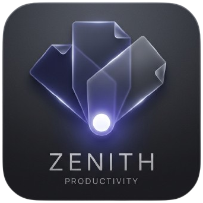
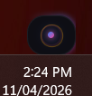
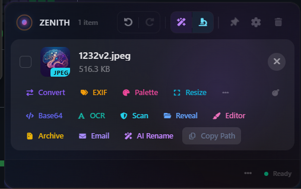
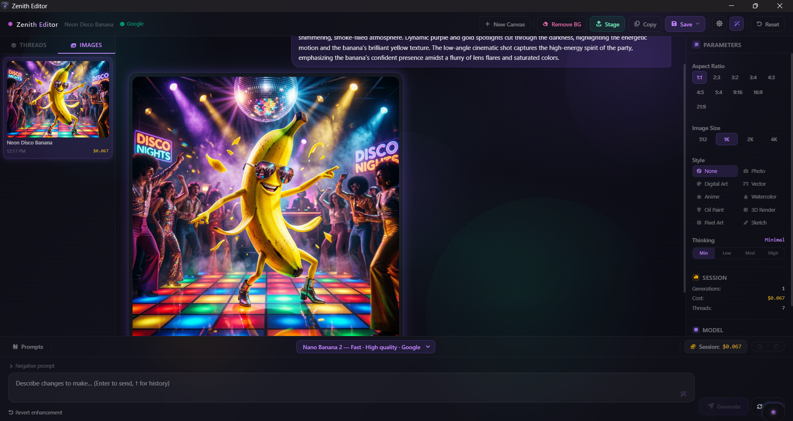

<div align="center">

# ⚡ ZENITH

<p align="center">
  
</p>

### The AI-Powered Desktop Productivity Command Center

**Drop it. Process it. Organize it. Ship it. — All from the edge of your screen.**

[](https://v2.tauri.app)
[](https://react.dev)
[](https://www.rust-lang.org)
[](https://python.org)
[]()
[](LICENSE)

[]()
[]()
[]()
[]()
[]()

*A glassmorphic floating workspace that transforms how you handle files, media, and documents on Windows. Screenshot, tag, batch-process, organize with AI, encrypt — all without opening a single folder.*

---

**[The Bubble](#-the-bubble--main-entry-point)** &bull; **[Secure Key Storage](#-secure-api-key-storage)** &bull; **[Auto-Studio](#-auto-studio--smart-organize)** &bull; **[Generative Editor](#-generative-editor)** &bull; **[Screen Capture](#-screen-capture)** &bull; **[Batch Queue](#-batch-operations-queue)** &bull; **[Smart Rename](#-smart-rename-engine)** &bull; **[Settings](#-settings-hub)** &bull; **[Quick Start](#-quick-start)** &bull; **[Architecture](#%EF%B8%8F-architecture)**

[]()
[]()
[]()

</div>

---

## What is Zenith?

Zenith is an **invisible desktop productivity tool** that floats at the edge of your screen. Drag a file near it — a beautifully animated dark-glass panel springs open. Drop files, paste text, screenshot your screen, scan for malware, convert media, tag and organize your files with AI, and drag results back out to any application — all without ever leaving what you're doing.

> **150+ features · 40+ file actions · 5 AI providers · AES-256-GCM encrypted vault · Shazam music recognition · Screen capture · Clipboard history · Batch processing · Color tagging · Activity log · Zero window switching.**

---

## 📸 Screenshots

### The Bubble — Drag & Drop Command Center

> The main entry point. A tiny floating pill on the edge of your screen that expands into a full action panel when files are dragged near it.

<p align="center">
  
  &nbsp;&nbsp;&nbsp;
  
</p>

*Left: The collapsed pill — barely visible, always on top, zero screen real estate. Right: Drop a file and the full action panel expands with 40+ instant actions (Convert, EXIF, Palette, Resize, Base64, OCR, Scan, Reveal, Editor, Archive, Email, AI Rename, and more).*

---

### Zenith Generative Editor

> The full-window AI image studio. Conversational multi-turn generation, thread history, react-bits effects, dark/light theme, and natural-language prompt enhancement.

<p align="center">
  
</p>

*The editor with a generated image in the chat timeline. Left: thread list with cost and image count badges. Center: user prompt bubble + AI image response with Copy / Edit from here / Stage actions. Right: aspect ratio grid, image size, style picker, Thinking level toggle, and session summary. Bottom: model selector, session cost, prompt textarea with ✨ enhance, negative prompt toggle, and the Generate button.*

---

## 🫧 The Bubble — Main Entry Point

The **Bubble** is Zenith's floating command center — a tiny, always-visible pill that sits at the edge of your screen and never gets in your way.

### Drag & Drop Pipeline

- **Drag IN** — Drop files, folders, or entire directory trees onto the floating pill to stage them
- **Drag OUT** — Drag processed files back out to Explorer, Photoshop, Slack, Discord, etc. via native Win32 OLE `DoDragDrop`
- **Deep folder parsing** — Dropped directories recursively expand via Rust `walkdir`, flattening hundreds of files while retaining path context
- **Multi-select** — Click to select, batch-process, or drag multiple items at once

### Glassmorphic UI

- **Pill ↔ Panel** — Magnetic hover expands a minimal floating pill into a full dark-glass panel with spring-physics animations (Framer Motion)
- **Pin mode** — Pin the panel open while you work; unpin to auto-collapse
- **Dynamic preview drawer** — Preview images, video, audio, code, CSV, JSON, and PDFs inline without leaving the panel
- **Dark / Light theme** — Full theme engine via CSS custom properties with configurable accent colors, border glow, aurora background

### 40+ Built-in File Actions

| Category | Actions |
|----------|---------|
| **Image** | Convert Format, Resize (+ fill color for ratio changes), EXIF Strip/Preview, Color Palette + WCAG + Ink Dropper, Base64 (Raw/HTML/CSS/TXT), OCR (Vision AI + Tesseract), Open in Generative Editor |
| **AI Image Gen** | Generative Editor — text-to-image, image-to-image, conversational multi-turn editing, 3 models, thread management, 10 aspect ratios, 9 style presets, prompt library, cost tracking, dark/light theme, negative prompt, clipboard copy |
| **PDF** | Compress, Merge (multi-PDF), PDF → CSV (LLM-powered structured extraction) |
| **Audio** | Shazam Music Recognition (fingerprint → identify → metadata), Convert Audio, Batch Audio Convert + Recognize |
| **Video** | FFmpeg Convert (MP4, WebM, GIF) |
| **Archive** | Zip / 7z with compression level (1–9), AES-256 Encrypt, Split File into chunks |
| **Communication** | Email with Attachments (native mailto) + LLM auto-draft Subject/Body |
| **AI-Powered** | Smart Rename, Smart Sort, Auto-Studio Organize + Undo, Translate (15+ languages), Ask Data (RAG Q&A), Summarize, Super Summary, Generate Dashboard (CSV → interactive Chart.js HTML) |
| **Security** | VirusTotal deep scan (file hash → upload → poll), URL scan, batch scan |
| **Utility** | QR Code generator, File Preview, Copy Path, Reveal in Explorer, Self-Destruct Timer |

---

## 🔐 Secure API Key Storage

Zenith stores your API keys in your operating system's **native credential manager** — never in plaintext on disk.

- **Windows** — Windows Credential Manager (Credential Locker)
- **macOS** — Keychain Access
- **Linux** — Secret Service (gnome-keyring / KWallet)

Each API key is stored as a separate secure entry. When needed, the key is retrieved directly from the credential manager — no master password required, no lock screens. Your OS handles the encryption and access control transparently.

| Key Type | Credential Name Pattern |
|----------|------------------------|
| OpenAI/Anthropic/etc | `zenith-app/api_key/{provider}` |
| VirusTotal | `zenith-app/secret/vt` |
| OMDB | `zenith-app/secret/omdb` |
| TheAudioDB | `zenith-app/secret/audiodb` |
| IMDb | `zenith-app/secret/imdb` |

> Your API keys are never written to `settings.json` in plaintext. Even with filesystem access, keys are only accessible through the OS credential vault.

---

## 🏷️ Color Tagging System

Organize staged items visually with 8 color-coded tags.

- **Click the tag icon** on any staged item card to reveal the 8-color picker (Red, Orange, Amber, Green, Cyan, Blue, Violet, Pink)
- **Tag persists across sessions** — saved to `%APPDATA%/Zenith/tags.json`
- **Click an active tag** to remove it instantly
- Tags appear as colored badges next to the file size

---

## 📋 Clipboard History

Zenith remembers everything you copy.

- **100-entry persistent history** — every text you paste into Zenith (via `Ctrl+V` or the global shortcut `Ctrl+Shift+V`) is saved automatically
- **Collapsible History panel** — accessible from the footer menu with timestamps, text previews, and one-click re-stage buttons
- **Clear button** — wipe the entire history with one click
- Stored to disk at `%APPDATA%/Zenith/clipboard_history.json`

---

## 🔄 Batch Operations Queue

Process multiple files at once with real-time progress tracking.

- **Footer → Batch Process** — 3 built-in presets: Compress Images, Convert to WebP, AI Smart Rename
- **Sequential execution** — files are processed one by one with per-item error isolation (one failure doesn't stop the queue)
- **Progress bar** — animated gradient bar shows current/total with action label
- **Auto-stage results** — processed files are automatically added to the staging area
- **Activity logging** — every batch operation is recorded in the Activity Log

---

## 📸 Screen Capture

Capture your full screen with one click — instantly staged for processing.

- **Camera button** in the Bubble header — click to take a full-screen screenshot
- **Platform-native** — uses PowerShell on Windows, `screencapture` on macOS, `import` on Linux
- **Auto-staged** — the captured PNG is automatically added to the staging area
- **Logged** — every capture is recorded in the Activity Log

---

## 📊 Activity Log

A complete audit trail of every operation.

- **Settings → Activity tab** — scrollable log with timestamps, action type, and details
- **Tracks**: Stage, Clear, Clipboard, Batch, Screenshot, Token Usage
- **500-entry rotating buffer** — oldest entries are automatically pruned
- **Clear button** — reset the log with one click
- Stored to disk at `%APPDATA%/Zenith/activity_log.json`

---

## ✨ Auto-Studio — Smart Organize

> *Drop 50 messy files. Click one button. Review a beautiful plan. Execute with one click. Undo with one click.*

The **Auto-Studio** is Zenith's flagship file organization feature — a sliding auxiliary panel that turns chaotic file dumps into perfectly organized media libraries.

### How It Works

1. **Drop** a messy folder (or 50 mixed files) into Zenith
2. Click **✨ Smart Organize** — the Review Studio panel slides out
3. A progress bar tracks API lookups as Zenith analyzes every file
4. You see a **tree view** of proposed changes:
   - 🎵 `The Weeknd - After Hours (2020)/` — renamed MP3s + fetched album art
   - 🎬 `Dune Part Two (2024)/` — renamed MKV + downloaded OMDB posters
   - 📄 `Financial/` — 4 renamed PDF invoices (AI-categorized)
   - 📷 `Photos - 2026-03/` — 10 photos grouped by EXIF date
5. **Tweak** any name with inline editing, toggle items on/off, pick grouping options
6. Click **🚀 Execute Plan** — all disk operations happen transactionally
7. Changed your mind? Click **↩ Undo** — everything reverts perfectly

### Media Intelligence Engine

| File Type | Intelligence | API |
|-----------|-------------|-----|
| **Music** (.mp3, .flac, .wav, .ogg, .aac, .m4a) | Album, year, artist, genre, cover art + Shazam fingerprint fallback | [TheAudioDB](https://www.theaudiodb.com) + [Shazam](https://www.shazam.com) via [SongRec](https://github.com/marin-m/SongRec) |
| **Video** (.mp4, .mkv, .avi, .mov, .webm) | Title, year, director, rating, poster download; SxxExx series detection | [OMDB](https://www.omdbapi.com) |
| **Images** (.jpg, .png, .gif, .webp, .heic) | EXIF date grouping **or** AI Vision semantic titles | LLM Vision |
| **Documents** (.pdf, .docx, .txt, .csv, .xlsx) | Semantic categorization (Business/Financial/Legal/Personal) or type grouping | LLM Analysis |

---

## 🎨 Generative Editor

> *Drop an image, click Editor. Type a prompt. Watch the AI repaint it. Chain 10 edits. Compare. Save. Stage.*

The **Generative Editor** is a full-window AI image creation and editing studio — redesigned with a cinematic dark/light theme system, live react-bits visual effects, and a natural-language prompt intelligence layer.

### Supported Models

| Model | Provider | Best For |
|-------|----------|----------|
| **Nano Banana 2** (`gemini-3.1-flash-image-preview`) | Google | Fast iterations, daily use, 4-level thinking |
| **Nano Banana Pro** (`gemini-3-pro-image-preview`) | Google | High-quality, deep reasoning |
| **GPT-Image 1.5** (`gpt-image-1.5`) | OpenAI | Photorealism, high-adherence edits |

### Core Features

- **Conversational multi-turn editing** — each generation uses the current output as the next input; chain unlimited edits across threads
- **Thread management** — create, switch, and delete named sessions; thread titles auto-generated from first prompt
- **Before/After compare** — hold the "Compare Original" pill to flip between original and AI-edited version
- **Send to Stage** — save current canvas to temp and stage it back into the main panel with one click
- **Session cost tracker** — live cumulative USD cost; per-thread totals
- **Background removal** — two-step AI green-screen + local chroma-key; powered by Gemini vision
- **Copy to clipboard** — copies the current image as PNG directly to the system clipboard
- **Negative prompt** — collapsible field below the main prompt
- **Prompt history** — press ↑ / ↓ in the textarea to cycle through the last 50 prompts
- **Keyboard shortcuts** — `Escape` closes modals, `Ctrl+Z` undo, `Ctrl+Shift+Z` redo

### Visual Effects Layer

| Effect | Where |
|--------|-------|
| **AuroraBg** | Animated color aurora drifts behind the chat timeline |
| **GlowOrbs** | Soft ambient orbs float behind the panels |
| **SpotlightCard** | Cursor spotlight follows mouse across thread cards |
| **ClickSpark** | Particle burst fires on every click |
| **ShinyText** | "Zenith Editor" title has a live metallic shimmer sweep |
| **GlareHover** | Subtle 3D glare + tilt effect on image thumbnails |
| **StarBorder** | Rotating conic-gradient star border wraps the Generate button |
| **FloatingParticles** | Glowing particles drift up in the empty canvas state |

---

## ✨ Smart Rename Engine

Zenith doesn't just rename files — it **reads their soul**.

### 3-Step Context Pipeline

1. **Content Extraction** — Vision AI for images, first-page text for PDFs, EXIF/ID3 for media, first 50 lines for code
2. **Format Enforcement** — AI strictly follows your naming convention (PascalCase, snake_case, kebab-case, or custom)
3. **Extension Locking** — Rust physically separates stem from extension. The AI never touches `.pdf` or `.mp3`. Ever.

### The UX Flow

- **Single file:** Click ✨ — the filename transforms into a shimmering skeleton loader, then morphs into the new name
- **3 inline controls:** ✅ Accept · 🎲 Cycle alternate suggestion · ✏️ Manual edit
- **Batch rename:** Select files → click ✨ Batch Rename
- **Undo/Redo:** ↩/↪ icons in the header — one click reverts actual files on disk

---

## 🛡️ Security & Scanning

### VirusTotal Deep Integration

Not just a hash lookup — Zenith implements the **full VirusTotal v3 pipeline**:

- **Files:** SHA-256 hash check → if unknown, **uploads the file** → polls analysis → full detection report
- **URLs:** Base64 lookup → if unknown, **submits for scanning** → polls analysis → verdict
- **Batch scanning** from the multi-select toolbar
- **Results:** 🟢 Safe / 🔴 Malicious badge with detection count, engine names, and community score
- Supports files up to **650MB** via the large-file upload endpoint

---

## 🤖 AI & LLM Integrations

Zenith connects to **5 LLM providers** with **18+ models**. API keys are encrypted at rest with AES-256-GCM.

| Provider | Models | Best For |
|----------|--------|----------|
| **OpenAI** | GPT-4.1 Nano, GPT-4.1 Mini, GPT-4.1, GPT-4o, GPT-4o Mini, o3 Mini, o4 Mini | Rename, Sort, Summarize, Dashboard |
| **Anthropic** | Claude Haiku 4.5, Claude Sonnet 4, Claude Opus 4 | Ask Data, Deep Analysis |
| **Google** | Gemini 3.1 Flash Lite, 3.1 Flash, 3.1 Pro | OCR Vision, Super Summary, Fast Processing, Image Generation |
| **DeepSeek** | Chat (V3), Reasoner (R1) | Budget-friendly bulk processing, reasoning |
| **Groq** | Llama 3.3 70B, Llama 3.1 8B, Gemma 2 9B | Ultra-fast processing |

---

## 📌 Settings Hub

A full-featured settings panel with 10 tabs:

| Tab | What You Control |
|-----|-----------------|
| **General** | Launch at startup, tray icon, plugins directory, **Export/Import settings** |
| **Appearance** | Accent color, opacity, blur intensity, corner radius, font size, border glow, aurora background, spotlight cards, animation speed |
| **Behavior** | Collapse delay, hover/drag expand triggers, max items, duplicate detection, screen position, confirm clear all |
| **Processing** | Image quality, WebP quality, resize %, PDF compression level, split chunk size |
| **API Keys** | Per-provider key management · pricing display · OMDB/VirusTotal/TheAudioDB/IMDb keys · Shazam toggle |
| **AI Prompts** | All 9 system prompts editable (File Management, Document Intelligence, Vision & Data) |
| **Token Usage** | Per-provider usage cards with cost breakdown · total spend tracking · reset button |
| **Activity** | Full operation history — timestamps, action type, details · clear button |
| **Shortcuts** | Configurable keyboard shortcuts (stage clipboard, toggle window, clear all) |
| **Scripts** | WASM plugin manager with enable/disable toggles |

---

## 🔌 Plugin System (WASM)

Zenith supports **sandboxed WASM plugins** via [wasmtime](https://wasmtime.dev):

- Drop a `.wasm` file into Settings → Scripts
- Enable/disable with a toggle
- Plugins run in a sandboxed environment with no filesystem access outside approved paths

---

## 🌐 REST API

Zenith exposes a local HTTP API on port **7890** for plugin and external integration use:

```
GET  /health                — Health check
GET  /items                 — List all staged items
POST /stage/file            — Stage a file from path
POST /stage/text            — Stage text from clipboard
DELETE /items               — Clear all items
DELETE /items/{id}          — Remove specific item
POST /items/{id}/self-destruct — Set self-destruct timer
POST /process               — Execute any processing action
GET  /settings              — Read current settings
PUT  /settings              — Update settings
GET/POST/DELETE /window/*   — Script window management
GET/POST /browse            — Browse directory contents
```

---

## 🚀 Quick Start

### Prerequisites

| Requirement | Version | Purpose |
|-------------|---------|---------|
| **Node.js** | 18+ | Frontend build tooling |
| **Rust** | stable (via [rustup](https://rustup.rs)) | Tauri backend |
| **Python** | 3.10+ | AI & file processing sidecar |
| Tesseract OCR | *optional* | Local OCR fallback |
| FFmpeg | *optional* | Media conversion |

### One-Click Start (Windows)

```bat
git clone https://github.com/YOUR_USERNAME/zenith-app.git
cd zenith-app
zenith.bat
```

`zenith.bat` checks prerequisites, installs Node + Python dependencies, and offers 3 options: Rebuild release, Launch current build, or Start dev server.

### Manual Setup

```bash
git clone https://github.com/YOUR_USERNAME/zenith-app.git
cd zenith-app

npm install
pip install -r scripts/requirements.txt

npm run tauri dev
```

### Build for Production

```bash
npm run tauri build
```

Outputs both `.msi` and `.exe` (NSIS) installers in `src-tauri/target/release/bundle/`.

---

## ⚙️ Architecture

```
  React 19 (UI)  ────  Rust / Tauri v2 (OS layer)  ────  Python sidecar (AI + processing)
       │                         │                               │
  Framer Motion 12        Native OLE drag-drop           40+ file actions
  Tailwind CSS 4          Multi-window architecture      5 LLM providers + image gen
  Zustand 5               Encrypted vault (AES-256-GCM)  TheAudioDB / OMDB / IMDb API
  react-markdown          Clipboard interception         Shazam fingerprint recognition
  remark-gfm              WASM plugin engine (wasmtime)  PDF / Image / Media / OCR
  Font Awesome 7          HTTP API server (:7890)         VirusTotal v3 integration
                          Screen capture engine
                          Transactional file I/O
                          walkdir recursive traversal
                          Rename undo/redo history
                          Activity log + clipboard history
```

### Tech Stack

| Layer | Technology |
|-------|------------|
| **Framework** | [Tauri v2](https://v2.tauri.app) |
| **Backend** | Rust (serde, serde_json, walkdir, wasmtime, image, uuid, reqwest, aes-gcm, argon2, sha2, hex, rand) |
| **Frontend** | React 19, TypeScript, Tailwind CSS 4, Framer Motion 12 |
| **State** | Zustand 5 |
| **Markdown** | react-markdown + remark-gfm (full GFM: tables, code blocks, footnotes) |
| **AI Python** | OpenAI / Anthropic / Google GenAI / DeepSeek / Groq SDKs |
| **OCR** | Tesseract (local) + LLM Vision fallback |
| **Media** | FFmpeg (convert), SongRec (Shazam fingerprint) |
| **Testing** | Vitest, jsdom |
| **Plugins** | wasmtime (WASM sandbox) |

---

## 📁 Data Storage

All user data is stored locally in `%APPDATA%/Zenith/`:

```
%APPDATA%/Zenith/
├── settings.json         — Configuration (API keys encrypted)
├── state.json            — Persisted staged items (survives app restart)
├── tags.json             — Per-item color tags
├── activity_log.json     — Operation history (500 entries)
├── clipboard_history.json — Last 100 clipboard entries
├── rename_history.json   — Undo/redo rename stack
├── tags.json             — Color-coded item labels
├── presets.json          — User-saved conversion presets (localStorage)
└── plugins/              — WASM plugin storage
```

---

## 📋 Changelog

### v0.2.0 (latest)

**Security**
- ✅ **Native OS Credential Storage** — API keys stored in Windows Credential Manager / macOS Keychain / Linux Secret Service via the `keyring` crate. No plaintext keys on disk. No master password required.
- ✅ **All API keys secured** — OpenAI, Anthropic, Google, DeepSeek, Groq, VirusTotal, OMDB, TheAudioDB, IMDb keys individually encrypted

**New Features**
- ✅ **Screen Capture** — One-click full-screen screenshot via camera button. Auto-stages PNG. Windows (PowerShell), macOS (screencapture), Linux (import).
- ✅ **Clipboard History** — 100-entry persistent history with timestamps, text previews, re-stage buttons. Auto-saves on paste.
- ✅ **Color Tagging** — 8-color tag system on staged items. Persistent across sessions.
- ✅ **Batch Operations Queue** — Sequential multi-file processing with progress bar. 3 presets: Compress, Convert to WebP, AI Rename.
- ✅ **Activity Log** — Full operation audit trail in Settings → Activity. 500-entry rotating buffer.
- ✅ **Export/Import Settings** — Copy settings to clipboard or import from clipboard in Settings → General.
- ✅ **Conversion Presets** — Save and apply named presets. localStorage persistence.

**Fixes & Polish**
- ✅ All behavior settings now functional (duplicate_detection, max_staged_items, confirm_clear_all, expand_on_hover/drag)
- ✅ Global shortcuts toggle_window and clear_all registered
- ✅ Error boundaries on all windows (main, settings, editor, script)
- ✅ Token usage tracking unified across all components
- ✅ MIME type fix: `image/x-icon` → `image/vnd.microsoft.icon`
- ✅ Pricing data deduplicated — single source of truth in `src/shared/pricing.ts`
- ✅ 36 tests passing (utils, store, helpers)
- ✅ Lock screen overlay for vault-protected sessions

**Removed**
- Removed research pipeline, Sci-Hub integration, medical literature tools (moved to separate app)

---

## 📄 License

MIT — see [LICENSE](LICENSE) for details.

---

<div align="center">

Built with ⚡ by the Zenith team · Tauri v2 · React 19 · Rust · Python

*Your files. Your rules. Your privacy.*

</div>
