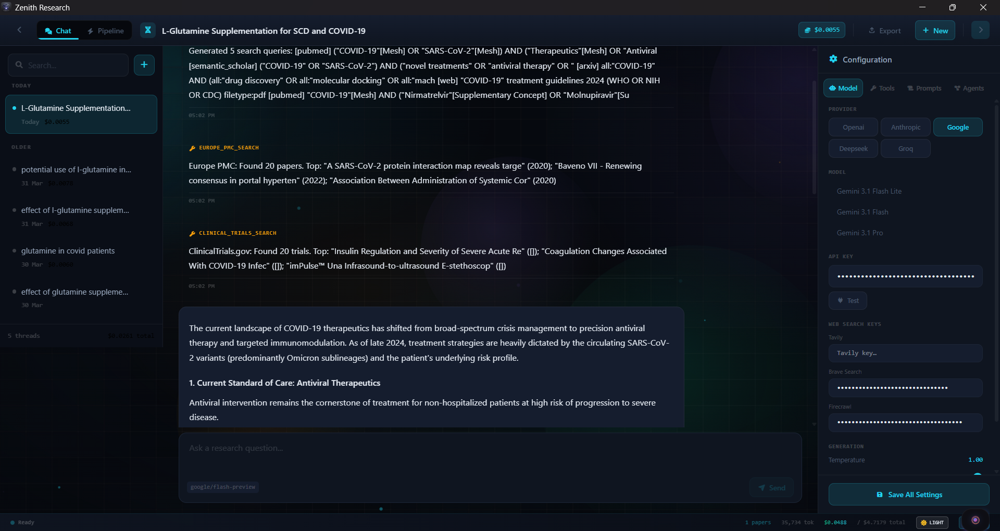
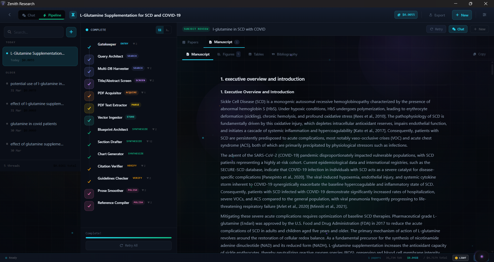

<div align="center">

# ⚡ ZENITH

<p align="center">
  
</p>

### The AI-Powered File Command Center & Research Intelligence Platform for Windows

**Drop it. Organize it. Research it. Ship it. — All from the edge of your screen.**

[](https://v2.tauri.app)
[](https://react.dev)
[](https://www.rust-lang.org)
[](https://python.org)
[](LICENSE)

[]()
[]()
[]()
[]()
[]()

*A glassmorphic floating workspace that transforms how you handle files, media, documents, and AI research workflows on Windows.*

---

**[The Bubble](#-the-bubble--main-entry-point)** &bull; **[Research Window](#-zenith-research-window--v61)** &bull; **[Auto-Studio](#-auto-studio--the-review-panel)** &bull; **[Generative Editor](#-zenith-generative-editor)** &bull; **[Smart Rename](#-smart-rename-engine)** &bull; **[Settings](#-settings-hub)** &bull; **[Quick Start](#-quick-start)** &bull; **[Architecture](#%EF%B8%8F-architecture)**

</div>

---

## What is Zenith?

Zenith is an **invisible desktop command center** that floats at the edge of your screen. Drag a file near it — a beautifully animated dark-glass panel springs open. Drop files, paste text, scan for malware, convert media, organize your entire Downloads folder with AI, and drag results back out to any application — all without ever leaving what you're doing.

But Zenith is also a **full PhD-level research intelligence platform**. Click Research — a cinematic dark-glass window opens. Ask a question in chat, or launch a fully autonomous 44-step pipeline that harvests papers from 7 databases, acquires PDFs via Sci-Hub, extracts PICO data, runs meta-analyses, generates forest plots, and writes publication-ready manuscripts — all configurable down to each agent's system prompt.

> **200+ features · 40+ file actions · 5 AI providers · 44-step autonomous research pipeline · 50+ free academic APIs · Shazam music recognition · Zero window switching.**

---

## 📸 Screenshots

### The Bubble — Drag & Drop Command Center

> The main entry point. A tiny floating pill on the edge of your screen that expands into a full action panel when files are dragged near it.

<p align="center">
  
  &nbsp;&nbsp;&nbsp;
  
</p>

*Left: The collapsed pill — barely visible, always on top, zero screen real estate. Right: Drop a file and the full action panel expands with 40+ instant actions (Convert, EXIF, Palette, Resize, Base64, OCR, Scan, Reveal, Editor, Archive, Email, AI Rename, and more).*

---

### Zenith Research Window — Chat Mode

> Interactive AI research assistant with 30+ live academic tools. Search 7 databases simultaneously, download papers, verify citations, and draft sections — all from a single conversation.

<p align="center">
  
</p>

*Chat mode: the AI dispatches multi-database searches (PubMed, Semantic Scholar, OpenAlex, ClinicalTrials, Europe PMC), surfaces relevant papers with tool-call badges, and drafts structured responses with full GFM markdown rendering — tables, citations, and code blocks included. The left sidebar shows date-grouped research threads; the right panel is the inline configuration drawer.*

---

### Zenith Research Window — Pipeline Mode

> Autonomous 44-step research pipeline. One research question → publication-ready manuscript with embedded figures, tables, and bibliography.

<p align="center">
  
</p>

*Pipeline mode: the left column shows the live Agent Activity Feed with per-step status badges (Gatekeeper → Query Architect → Multi-DB Harvest → Triage → PDF Acquire → Extract → Blueprint → Draft → Figures → Verify → Smooth → Compile). The main panel shows the completed manuscript rendered in the 4-tab Manuscript Preview (Manuscript / Figures / Tables / Bibliography). The progress bar at the top tracks the 44-step pipeline in real time.*

---

## 🫧 The Bubble — Main Entry Point

The **Bubble** is Zenith's floating command center — a tiny, always-visible pill that sits at the edge of your screen and never gets in your way.

### Drag & Drop Pipeline

- **Drag IN** — Drop files, folders, or entire directory trees onto the floating pill to stage them (zero-copy — stores paths only)
- **Drag OUT** — Drag processed files back out to Explorer, Photoshop, Slack, Discord, etc. via native Win32 OLE `DoDragDrop`
- **Deep folder parsing** — Dropped directories recursively expand via Rust `walkdir`, flattening hundreds of files while retaining path context
- **Multi-select** — Click to select, batch-process, or drag multiple items at once

### Glassmorphic UI

- **Pill ↔ Panel** — Magnetic hover expands a minimal floating pill into a full dark-glass panel with spring-physics animations (Framer Motion)
- **Click-through mode** — Collapsed pill is invisible to your mouse; zero interference with your workflow
- **Pin mode** — Pin the panel open while you work; unpin to auto-collapse
- **Dynamic preview drawer** — Preview images, video, audio, code, CSV, JSON, and PDFs inline without leaving the panel

### 40+ Built-in File Actions

| Category | Actions |
|----------|---------|
| **Image** | Convert Format, Resize (+ fill color for ratio changes), EXIF Strip/Preview, Color Palette + WCAG + Ink Dropper, Base64 (Raw/HTML/CSS/TXT), OCR (Vision AI + Tesseract), Open in Generative Editor |
| **AI Image Gen** | Zenith Generative Editor — text-to-image, image-to-image, conversational multi-turn editing, 3 models, thread management, 10 aspect ratios, 9 style presets, prompt library, cost tracking |
| **PDF** | Compress, Merge (multi-PDF), PDF → CSV (LLM-powered structured extraction) |
| **Audio** | Shazam Music Recognition (fingerprint → identify → metadata) |
| **Media** | FFmpeg Convert (MP4, MP3, WebM, WAV, GIF) |
| **Archive** | Zip / 7z with compression level (1–9), AES-256 Encrypt, Split File into chunks |
| **Communication** | Email with Attachments (native mailto) + LLM auto-draft Subject/Body |
| **AI-Powered** | Smart Rename, Smart Sort, Auto-Studio Organize + Undo, Translate (15+ languages), Ask Data (RAG Q&A), Summarize, Super Summary, Generate Dashboard (CSV → interactive Chart.js HTML) |
| **Security** | VirusTotal deep scan (file hash → upload → poll), URL scan, batch scan |
| **Utility** | QR Code generator, File Preview, Copy Path, Reveal in Explorer |

### Clipboard Superpowers

- **Stack Mode** — Toggle on, hit `Ctrl+C` multiple times, then merge all clipboard entries with one click
- **Text & URL staging** — Paste any text or URL directly into Zenith as a card
- **Image paste** — Hit PrintScreen then `Ctrl+V` inside Zenith to stage a screenshot as a PNG card instantly
- **Global shortcut** — `Ctrl+Shift+V` stages clipboard content instantly from anywhere

### Self-Destruct & Ephemeral Files

- Set **5 min / 30 min / 1 hour / 24 hour** self-destruct timers on any staged item
- Live countdown badge with automatic cleanup

---

## 🔬 Zenith Research Window — v6.1

> *Click Research. Ask a question — or launch a full autonomous 44-step pipeline. Get papers, PICO extractions, meta-analyses, forest plots, PRISMA flowcharts, and publication-ready manuscripts — fully configurable down to each agent's system prompt.*

The **Zenith Research Window v6.1** is a PhD-level autonomous research intelligence platform for medical, biomedical, clinical, and pharmaceutical research. Built on a fully modular component architecture with 50+ free academic APIs and a mathematically rigorous statistical analysis engine.

### How to Open

- Click the **Research** button in the main panel header
- The window opens at **70% of your monitor width × 84% of monitor height** — fully resizable, always above the taskbar

---

### Visual Design System

The Research Window uses a **"Clinical Laboratory Command Center"** aesthetic:

- **Full light/dark mode toggle** — persisted across sessions; all CSS variables switch cleanly via `data-theme` attribute
- **Cinematic effects layer** (togglable): Aurora background blobs · Floating squares grid · Glow orbs · Floating particles · Click sparks · Spotlight cards · Star-border header
- **Framer Motion** spring animations throughout; all transitions 150ms
- **Geist Sans + Geist Mono** typography; `#06080d` void background, `#22d3ee` cyan accents, `#10b981` emerald success states

---

### Dual-Mode Operation

#### Chat Mode (Interactive)

Conversational AI with LLM-driven tool dispatch. Access all 30+ research tools directly from the chat interface.

**Message bubble features (new):**
- **Full GFM markdown rendering** — `react-markdown` + `remark-gfm`: tables, code blocks, bold/italic, superscripts, links
- **Hover action bar** on every bubble: Copy · Edit (user messages) · Retry · Quote-copy (assistant)
- **Stop button** appears in the input bar while the AI is generating
- **Inline cost display** — tokens used + estimated USD cost per message
- Auto-rename thread title from first message

#### Pipeline Mode (Autonomous v6.1 — 44 Atomic Steps)

Launch a fully automated systematic research pipeline. **Each step does exactly one thing** — the output of step N is the exact input of step N+1.

**Pipeline features (new):**
- **Thread restore** — switching to an old research thread re-populates the query and restores the manuscript view automatically
- **Manuscript auto-focus** — tab switches to Manuscript when pipeline completes
- **Stop / Retry / Continue from checkpoint** buttons always visible in pipeline header

---

### The 44-Step Atomic Pipeline

#### 🔍 Search Phase (Steps 1–8)

| Step | Agent | Action | Output |
|------|-------|--------|--------|
| 1 | **Gatekeeper** | Validate research question for specificity, scope, ethics | `{is_valid, domain, keywords, pico}` |
| 2 | **Query Architect** | Generate Boolean/MeSH search strings per database | `{queries: [{db, query_string}]}` |
| 3 | **PubMed Searcher** | Search MEDLINE via E-utilities with MeSH terms (50 results/query) | `{pubmed_papers[]}` |
| 4 | **S2 Searcher** | Search Semantic Scholar API (25 results/query) | `{s2_papers[]}` |
| 5 | **OpenAlex Searcher** | Search OpenAlex 240M+ works (10K/day free) | `{oa_papers[]}` |
| 6 | **arXiv Searcher** | Search arXiv preprints | `{arxiv_papers[]}` |
| 7 | **Europe PMC Searcher** | Search Europe PMC REST API (50 results/query) | `{epmc_papers[]}` |
| 8 | **Deduplicator** | Merge + deduplicate across all sources | `{unique_papers[], duplicates_removed}` |

#### 📋 Screen Phase (Steps 9–12)

| Step | Agent | Action | Output |
|------|-------|--------|--------|
| 9 | **Design Classifier** | Classify study design per paper | `{papers[] + study_design}` |
| 10 | **Title-Abstract Screener** | Include/exclude by PICO criteria | `{papers[] + inclusion_decision}` |
| 11 | **Retraction Checker** | Check DOIs via CrossRef + Retraction Watch CSV | `{papers[] + retraction_status}` |
| 12 | **Journal Checker** | Check Beall's predatory journal list | `{papers[] + journal_quality}` |

#### 📥 Acquire Phase (Steps 13–16)

| Step | Agent | Action | Output |
|------|-------|--------|--------|
| 13 | **Unpaywall Fetcher** | Check open-access availability per DOI | `{oa_urls[], not_oa_dois[]}` |
| 14 | **OA Downloader** | Download PDFs from OA URLs | `{downloaded_pdfs[], failed[]}` |
| 15 | **Sci-Hub Fetcher** | Try configurable Sci-Hub mirrors for remaining DOIs | `{scihub_pdfs[], captcha_needed[]}` |
| 16 | **PMC Fetcher** | Fetch structured XML from PubMed Central | `{pmc_texts[]}` |

#### 📄 Parse Phase (Steps 17–19)

| Step | Agent | Action | Output |
|------|-------|--------|--------|
| 17 | **PDF Text Extractor** | Extract raw text from PDFs (pdfplumber) | `{raw_texts[]}` |
| 18 | **Section Parser** | Parse raw text into structured sections | `{structured_papers[{sections[]}]}` |
| 19 | **Reference Extractor** | Extract reference list from full text | `{papers[] + references_raw}` |

#### 📊 Store Phase (Steps 20–22)

| Step | Agent | Action | Output |
|------|-------|--------|--------|
| 20 | **Text Chunker** | Chunk texts with section metadata | `{chunks[]}` |
| 21 | **Vector Ingestor** | Embed & store chunks in ChromaDB | `{chunks_stored, collection_size}` |
| 22 | **BM25 Indexer** | Build keyword index for hybrid search | `{bm25_index_ready}` |

#### 📈 Extract Phase (Steps 23–26)

| Step | Agent | Action | Output |
|------|-------|--------|--------|
| 23 | **PICO Extractor** | LLM-powered PICO extraction per paper | `{pico_extractions[]}` |
| 24 | **Outcome Extractor** | Extract effect sizes, CIs, p-values | `{outcome_data[]}` |
| 25 | **Drug Profiler** | Extract drug names, doses, regimens (RxNorm) | `{drug_profiles[]}` |
| 26 | **AE Extractor** | Extract adverse events (OpenFDA) | `{adverse_events[]}` |

#### ⚖️ Assess Phase (Steps 27–29)

| Step | Agent | Action | Output |
|------|-------|--------|--------|
| 27 | **Bias Assessor** | RoB-2 / ROBINS-I / NOS per paper | `{bias_assessments[]}` |
| 28 | **GRADE Assessor** | Rate certainty per outcome (⊕⊕⊕⊕ scale) | `{grade_table[]}` |
| 29 | **Publication Bias Detector** | Egger's + Begg's + trim-fill | `{pub_bias_result}` |

#### 📝 Synthesize Phase (Steps 30–37)

| Step | Agent | Action | Output |
|------|-------|--------|--------|
| 30 | **Meta-Analyst** | DerSimonian-Laird pooled effect calculation | `{pooled_effect, ci, i_squared, tau²}` |
| 31 | **Blueprint Architect** | Design manuscript structure + specific figure/table descriptions | `{sections[], figure_plan[], table_plan[]}` |
| 32 | **Section Drafter** | Draft ONE section with inline citations (loops N times) | `{section_text, citations_used[]}` |
| 33 | **Table Generator** | Generate comparison / summary tables (exec-based, stdout-captured) | `{tables[]}` |
| 34 | **Forest Plot Generator** | matplotlib forest plot → PNG | `{image_path, caption}` |
| 35 | **Funnel Plot Generator** | Egger's / Begg's funnel plot | `{image_path, egger_p}` |
| 36 | **PRISMA Generator** | PRISMA 2020 flow diagram | `{image_path}` |
| 37 | **RoB Plot Generator** | Risk of bias traffic-light grid | `{image_path}` |

#### ✅ Verify Phase (Steps 38–41)

| Step | Agent | Action | Output |
|------|-------|--------|--------|
| 38 | **Citation Verifier** | NLI cross-encoder claim verification | `{verified[], hallucinated[]}` |
| 39 | **Guidelines Checker** | PRISMA / MOOSE / CARE / STROBE compliance | `{compliant[], violations[]}` |
| 40 | **Consistency Checker** | Text-vs-table contradiction detection | `{inconsistencies[]}` |
| 41 | **Final Retraction Check** | Re-verify all cited DOIs pre-publish | `{all_clear, retractions_found[]}` |

#### ✨ Polish Phase (Steps 42–44)

| Step | Agent | Action | Output |
|------|-------|--------|--------|
| 42 | **Prose Smoother** | Unify voice, fix grammar, add transitions; preserves `[FIGURE_N]` tags for figure injection | `{polished_manuscript}` |
| 43 | **Citation Formatter** | Format bibliography (Vancouver/APA/MLA) | `{bibliography, bibtex}` |
| 44 | **Exporter** | Build PDF (reportlab) + DOCX (python-docx) with embedded figures | `{pdf_path, docx_path}` |

---

### Figure & Table Embedding Pipeline

Figures and tables are **real files embedded directly into the exported PDF and DOCX**, not placeholders:

1. **Blueprint** generates specific chart descriptions: *"Bar chart comparing mean effect sizes across 8 RCTs, x-axis: study author, y-axis: SMD (95% CI), color: blue"*
2. **Figure Generator** runs matplotlib code → saves `.png` to `Research/charts/`
3. **Prose Smoother** receives `[FIGURE_N]` tags and is explicitly instructed to preserve them verbatim — any dropped tags are re-injected before the References section
4. Post-LLM: `[FIGURE_N]` → `` markdown
5. **PDF builder** parses `` syntax and embeds the actual image via `reportlab.platypus.Image`
6. **DOCX builder** parses the same syntax and embeds via `python-docx add_picture`
7. Export copies all assets to `~/Documents/Zenith Exports/<title>/assets/`

---

### Manuscript Export Package

Exported to `~/Documents/Zenith Exports/<research_title>_<timestamp>/`:

```
📁 My_Research_Export_20260411_143022/
├── manuscript.md          — Full polished manuscript (GFM)
├── manuscript.pdf         — PDF with embedded figures + tables (reportlab)
├── manuscript.docx        — Editable Word document with embedded figures (python-docx)
├── bibliography.bib       — BibTeX references
├── papers.json            — All harvested papers with metadata
├── pipeline_log.txt       — Full step-by-step audit trail
├── chat_history.md        — Chat conversation export
├── telemetry.json         — Token usage, cost, timing per phase
├── sections/              — Individual section markdown files
├── assets/                — All generated figures + tables as PNG files
├── references/            — Acquired PDFs
└── prompts/               — Full input/output log for every agent call
```

---

### Free Academic Data APIs (50+ Tools — No Paid Keys Required)

| API | Tool Name | What It Provides |
|-----|-----------|-----------------|
| **PubMed E-utilities** | `PUBMED_SEARCH` | MEDLINE search, MeSH terms, PMID fetch, XML metadata |
| **Semantic Scholar** | `LITERATURE_SEARCH` | 200M+ papers, citation graphs, open access links |
| **OpenAlex** | `LITERATURE_SEARCH` | 240M+ works, 10K/day free, full metadata |
| **arXiv** | `LITERATURE_SEARCH` | Preprints in physics, CS, bio, math |
| **Europe PMC** | `EUROPE_PMC_SEARCH` | Full-text biomedical literature, PMC IDs |
| **ClinicalTrials.gov v2** | `CLINICAL_TRIALS_SEARCH` | Registered trials, phases, outcomes, enrollment |
| **OpenFDA (Adverse Events)** | `OPENFDA_ADVERSE_EVENTS` | Drug adverse event reports by reaction type |
| **OpenFDA (Drug Labels)** | `OPENFDA_DRUG_LABELS` | FDA prescribing info, warnings, dosage, contraindications |
| **NLM MeSH E-utilities** | `MESH_LOOKUP` | Controlled vocabulary, synonyms, entry terms |
| **NLM RxNorm** | `RXNORM_LOOKUP` | Drug RxCUI, brand names, drug classes, ingredients |
| **CrossRef** | `RETRACTION_CHECK` | DOI validation, citation counts, journal metadata |
| **Retraction Watch CSV** | `RETRACTION_CHECK` | Retraction status, reason, date for 50K+ papers |
| **Beall's List Mirror** | Predatory Journal Check | Flag predatory/questionable journals |
| **Unpaywall** | OA Fetcher | Legal open-access PDF links by DOI |
| **Sci-Hub** | Acquisition | Full-text PDF download via user-managed mirror list |
| **DuckDuckGo / Brave / Tavily / Firecrawl** | `WEB_SEARCH` | Grey literature, clinical guidelines, news |

---

### Statistical Analysis Engine

All tools run locally — no external API, no data leaves your machine.

| Tool | Function | Method |
|------|----------|--------|
| **Meta-Analysis** | `META_ANALYSIS` | DerSimonian-Laird random effects; fixed effects; Q-stat; I²; τ² |
| **Forest Plot** | `FOREST_PLOT` | matplotlib — per-study CI bars + pooled diamond; dark theme |
| **Funnel Plot** | `FUNNEL_PLOT` | Egger's linear regression test; Begg's rank correlation; 95% funnel lines |
| **PRISMA 2020** | `PRISMA_FLOWCHART` | Full 4-phase flowchart with identification/screening/eligibility/included boxes |
| **Risk of Bias Plot** | `ROB_PLOT` | Traffic-light grid per study × domain (RoB-2 / ROBINS-I / NOS) |
| **GRADE Assessment** | `GRADE_ASSESS` | Certainty scoring (⊕⊕⊕⊕ → ⊕◯◯◯); downgrade/upgrade domains |
| **PICO Extraction** | `PICO_EXTRACT` | LLM-powered structured extraction of P/I/C/O + sample size + effect + CI + p |

---

### Study Designs Supported

| Design | Pipeline Prompt | Reporting Guideline |
|--------|----------------|---------------------|
| Systematic Review | `research_pipeline` | PRISMA 2020 |
| Meta-Analysis | `research_pipeline` | PRISMA-MA + MOOSE |
| Narrative Review | `research_pipeline` | PRISMA (adapted) |
| Scoping Review | `research_pipeline` | PRISMA-ScR |
| Subject Review | `subject_review` | Custom |
| Educational | `educational` | Custom |
| Case Study | `case_study` | CARE |
| Comparative Analysis | `comparative` | Custom |
| Exploratory Research | `exploratory` | Custom |

---

### Component Architecture

```
src/components/research/
├── ZenithResearch.tsx          — Shell: layout, routing, settings, toast, theme/FX toggles
├── HeaderBar.tsx               — Mode toggle, title editing, export dropdown, sidebar toggles
├── ThreadSidebar.tsx           — Date-grouped threads (Today/Yesterday/Older), search, delete
├── ChatView.tsx                — Multi-turn chat with react-markdown GFM rendering
│                                  MessageBubble: Copy · Edit · Retry · Quote · Stop · Cost badge
├── PipelineView.tsx            — 44-step pipeline orchestrator with checkpoint resume
│                                  Stop · Retry · Continue from checkpoint · Thread restore
├── AgentActivityFeed.tsx       — Live event timeline replacing hardcoded phase list
├── PaperBrowser.tsx            — Sortable/filterable paper list with expandable abstracts
├── ExtractionTable.tsx         — PICO data grid with monospace statistics columns
├── ManuscriptPreview.tsx       — 4-tab viewer: Manuscript (react-markdown+GFM) / Figures / Tables / Bibliography
├── SettingsPanel.tsx           — Full per-agent configurator in-window
└── effects/
    ├── AuroraBg.tsx            — rAF-driven radial gradient blob animation
    ├── SquaresBg.tsx           — Canvas animated grid with wave shimmer + mouse glow
    ├── GlowOrbs.tsx            — 5 sinusoidal floating orbs
    ├── ClickSpark.tsx          — SVG spark burst on every click
    ├── SpotlightCard.tsx       — Mouse-following radial spotlight overlay
    ├── ShinyText.tsx           — CSS background-clip shimmer sweep
    ├── GradientText.tsx        — Animated gradient text via background-position
    ├── StarBorder.tsx          — Rotating conic-gradient border
    ├── FloatingParticles.tsx   — Canvas 22-particle upward drift system
    └── GlareHover.tsx          — 3D perspective tilt + glare overlay
```

---

### Sci-Hub Mirror Management

The mirror list used for PDF acquisition is **fully manageable** from Settings → API Keys → Sci-Hub Mirrors:

- **Add** custom mirrors (any `https://` URL)
- **Remove** any mirror from the list
- **Reorder** with up/down arrows — first reachable mirror is tried first
- **Ping individual** mirrors — shows live latency in ms or "unreachable"
- **Ping All** — checks all mirrors simultaneously
- **Reset** to the built-in defaults (11 mirrors)
- Changes persist to `settings.json` and take effect on the next pipeline run

---

### Token & Cost Tracking

- **Per-message** cost shown inline in every chat bubble (tokens used + `$0.00045`)
- **Pipeline session** total shown in the status bar during/after a run
- **Cumulative all-time** cost shown next to the session cost: `$0.0234 / $2.1456 total`
- **Settings → Token Usage** tab: per-provider breakdown with input/output token counts and USD cost
- All data persists to `settings.json` via `trackTokenUsage()` → Rust `save_settings`

---

### Full Settings Configurability (Zero Hardcoded Prompts)

Every pipeline parameter is loaded from `%APPDATA%/Zenith/settings.json` and editable in Settings. **Nothing is hardcoded.**

| Setting | Where | What |
|---------|-------|------|
| **Pipeline Study Design Prompts** | Settings → Research Agents | Per-design system prompt (9 designs) |
| **Chat System Prompt** | Settings → AI Prompts → Research | The AI's persona for interactive chat |
| **Per-Agent System Prompt** | Settings → Research Agents → select agent | Step-specific override (empty = use global) |
| **Per-Agent Model Tier** | Settings → Research Agents | Fast (cheap screening) vs Strong (capable drafting) |
| **Per-Agent Temperature** | Settings → Research Agents | 0.0–1.0 per agent |
| **Per-Agent Max Tokens** | Settings → Research Agents | 512–65,536 per agent |
| **Per-Agent Thinking** | Settings → Research Agents | Enable extended thinking + budget per agent |
| **Per-Agent Tools** | Settings → Research Agents | Enable/disable tools per agent |
| **Sci-Hub Mirrors** | Settings → API Keys → Sci-Hub Mirrors | Add/edit/delete/reorder/ping mirrors |
| **API Keys** | Settings → API Keys | Per-provider keys (OpenAI, Anthropic, Google, DeepSeek, Groq) |
| **Web Search Keys** | Settings → API Keys | Tavily, Brave, Firecrawl |

**Agents configurable:** Gatekeeper · Query Architect · Triage Agent · Blueprint Architect · Lead Author · Citation Verifier · Guidelines Checker · Prose Smoother

---

## ✨ Auto-Studio — The Review Panel

> *Drop 50 messy files. Click one button. Review a beautiful plan. Execute with one click. Undo with one click.*

The **Auto-Studio** is Zenith's flagship file organization feature — a sliding auxiliary panel that turns chaotic file dumps into perfectly organized media libraries.

### How It Works

1. **Drop** a messy folder (or 50 mixed files) into Zenith
2. Click **✨ Smart Organize** — the Review Studio panel slides out
3. A progress bar tracks API lookups as Zenith analyzes every file
4. You see a **tree view** of proposed changes:
   - 🎵 `The Weeknd - After Hours (2020)/` — renamed MP3s + fetched album art
   - 🎬 `Dune Part Two (2024)/` — renamed MKV + downloaded OMDB posters
   - 📄 `Financial/` — 4 renamed PDF invoices (AI-categorized)
   - 📷 `Photos - 2026-03/` — 10 photos grouped by EXIF date
5. **Tweak** any name with inline editing, toggle items on/off, pick grouping options
6. Click **🚀 Execute Plan** — all disk operations happen transactionally
7. Changed your mind? Click **↩ Undo** — everything reverts perfectly

### Media Intelligence Engine

| File Type | Intelligence | API |
|-----------|-------------|-----|
| **Music** (.mp3, .flac, .wav, .ogg, .aac, .m4a) | Album, year, artist, genre, cover art + Shazam fingerprint fallback | [TheAudioDB](https://www.theaudiodb.com) + [Shazam](https://www.shazam.com) via [SongRec](https://github.com/marin-m/SongRec) |
| **Video** (.mp4, .mkv, .avi, .mov, .webm) | Title, year, director, rating, poster download; SxxExx series detection | [OMDB](https://www.omdbapi.com) |
| **Images** (.jpg, .png, .gif, .webp, .heic) | EXIF date grouping **or** AI Vision semantic titles | LLM Vision |
| **Documents** (.pdf, .docx, .txt, .csv, .xlsx) | Semantic categorization (Business/Financial/Legal/Personal) or type grouping | LLM Analysis |

---

## 🌟 Zenith Generative Editor

> *Drop an image, click Editor. Type a prompt. Watch the AI repaint it. Chain 10 edits. Compare. Save. Stage.*

The **Zenith Generative Editor** is a full-window AI image creation and editing studio.

### Supported Models

| Model | Provider | Best For |
|-------|----------|----------|
| **Nano Banana 2** (`gemini-3.1-flash-image-preview`) | Google | Fast iterations, daily use |
| **Nano Banana Pro** (`gemini-3-pro-image-preview`) | Google | High-quality, deep thinking |
| **GPT-Image 1.5** (`gpt-image-1.5`) | OpenAI | Photorealism, high-adherence edits |

### Key Features

- **Thread / session management** — left panel has Threads + Images tabs; create, switch, delete freely
- **Conversational editing** — each generation uses the current output as the next input; chain unlimited edits
- **Before/After toggle** — hold the comparison pill to flip between original and AI version
- **Prompt enhancement (✨)** — rough idea → LLM rewrites to a detailed professional prompt
- **Prompt library** — save, load, rename, delete prompts; full management UI
- **Session cost tracker** — live cumulative USD cost in the Command Deck; per-thread totals in Threads tab
- **Send to Stage** — save current canvas to temp and stage it back into the main panel with one click

---

## ✨ Smart Rename Engine

Zenith doesn't just rename files — it **reads their soul**.

### 3-Step Context Pipeline

1. **Content Extraction** — Vision AI for images, first-page text for PDFs, EXIF/ID3 for media, first 50 lines for code
2. **Format Enforcement** — AI strictly follows your naming convention (PascalCase, snake_case, kebab-case, or custom)
3. **Extension Locking** — Rust physically separates stem from extension. The AI never touches `.pdf` or `.mp3`. Ever.

### The UX Flow

- **Single file:** Click ✨ — the filename transforms into a shimmering skeleton loader, then morphs into `2026_03_DEWA_Utility_Bill.pdf`
- **3 inline controls:** ✅ Accept · 🎲 Cycle alternate suggestion · ✏️ Manual edit
- **Batch rename:** Select 15 files → click ✨ Batch Rename → diff-like list view with `Old Name → New Name` for every file
- **Undo/Redo:** Permanent ↩/↪ icons in the header — one click reverts actual files on disk

---

## 🛡️ Security & Scanning

### VirusTotal Deep Integration

Not just a hash lookup — Zenith implements the **full VirusTotal v3 pipeline**:

- **Files:** SHA-256 hash check → if unknown, **uploads the file** → polls analysis → full detection report
- **URLs:** Base64 lookup → if unknown, **submits for scanning** → polls analysis → verdict
- **Batch scanning** from the multi-select toolbar
- **Results:** 🟢 Safe / 🔴 Malicious badge with detection count, engine names, and community score
- Supports files up to **650MB** via the large-file upload endpoint

---

## 🤖 AI & LLM Integrations

Zenith connects to **5 LLM providers** with **18+ models**. API keys are stored locally and never leave your machine except to the provider you choose.

| Provider | Models | Best For |
|----------|--------|----------|
| **OpenAI** | GPT-4.1-nano, GPT-4.1-mini, GPT-4.1, GPT-4o, o3-mini, o4-mini | Rename, Sort, Summarize, Dashboard, Pipeline Strong |
| **Anthropic** | Claude Haiku 4.5, Sonnet 4, Sonnet 4.5, Opus 4, Opus 4.6 | Ask Data, Deep Analysis, Lead Author, Prose Smoother |
| **Google** | Gemini 3.1 Flash Lite, 3.1 Flash, 3.1 Pro | OCR Vision, Super Summary, Fast Pipeline |
| **DeepSeek** | Chat (V3), Reasoner (R1) | Budget-friendly bulk processing, reasoning steps |
| **Groq** | Llama 3.3 70B, Llama 3.1 8B, Gemma 2 9B | Ultra-fast screening and triage phases |

---

## 📌 Settings Hub

A full-featured settings panel with 10 tabs for the main app:

| Tab | What You Control |
|-----|-----------------|
| **General** | Launch at startup, tray icon, update checks, plugins directory |
| **Appearance** | Accent color, opacity, blur intensity, corner radius, font size, border glow, aurora background, spotlight cards |
| **Behavior** | Collapse delay, hover/drag expand triggers, max items, duplicate detection, screen position |
| **Processing** | Image quality, WebP quality, resize %, PDF compression level, split chunk size |
| **API Keys** | Per-provider key management · pricing display · OMDB/VirusTotal/Brave/Firecrawl/Tavily keys · **Sci-Hub mirror manager (add/edit/delete/reorder/ping)** |
| **AI Prompts** | All 16 system prompts editable (File Management, Document Intelligence, Vision & Data, Research pipeline per design) |
| **Research Agents** | Per-agent: system prompt override · model tier · temperature · max tokens · extended thinking + budget · structured output · enabled tools |
| **Token Usage** | Per-provider usage cards with cost breakdown · total spend tracking · reset button |
| **Shortcuts** | Configurable keyboard shortcuts (stage clipboard, toggle window, clear all) |
| **Scripts** | WASM plugin manager with enable/disable toggles |

---

## 🚀 Quick Start

### Prerequisites

| Requirement | Version | Purpose |
|-------------|---------|---------|
| **Node.js** | 18+ | Frontend build tooling |
| **Rust** | stable (via [rustup](https://rustup.rs)) | Tauri backend |
| **Python** | 3.10+ | AI & file processing sidecar |
| **scipy + matplotlib + numpy** | latest | Meta-analysis & statistical plots |
| **chromadb** | latest | Local vector database for RAG |
| Tesseract OCR | *optional* | Local OCR fallback (free) |
| FFmpeg | *optional* | Media conversion |

### One-Click Start (Windows)

```bat
git clone https://github.com/YOUR_USERNAME/zenith-app.git
cd zenith-app
start.bat
```

`start.bat` automatically installs Node + Python dependencies and launches the dev server.

### Manual Setup

```bash
# 1. Clone
git clone https://github.com/YOUR_USERNAME/zenith-app.git
cd zenith-app

# 2. Install Node dependencies
npm install

# 3. Install Python dependencies
pip install -r scripts/requirements.txt

# 4. Research statistical analysis dependencies
pip install scipy matplotlib numpy chromadb reportlab python-docx pdfplumber

# 5. Run in dev mode
npm run tauri dev
```

### Build for Production

```bash
npm run tauri build
```

Outputs both `.msi` and `.exe` (NSIS) installers in `src-tauri/target/release/bundle/`.

---

## ⚙️ Architecture

```
 React 19 (UI)  ────  Rust / Tauri v2 (OS layer)  ────  Python sidecar (AI + processing)
      │                         │                               │
 Framer Motion 12        Native OLE drag-drop           50+ file actions
 Tailwind CSS 4          Multi-window architecture      5 LLM providers + image gen
 Zustand 5               Clipboard interception         TheAudioDB / OMDB / imdbapi.dev
 react-markdown          Clipboard image paste          Shazam fingerprint recognition
 remark-gfm              WASM plugin engine (wasmtime)  PDF / Image / Media / OCR
 Font Awesome 7          HTTP API server (:7890)         VirusTotal v3 integration
                         reqwest async HTTP             Research v6.1 engine:
                         Transactional file I/O           ├── 44-step atomic pipeline
                         walkdir recursive traversal      ├── 50+ free academic APIs
                         Rust settings ↔ Python args      ├── Statistical analysis engine
                         Monitor-aware window sizing      │   (scipy/matplotlib/numpy)
                         (70% width, 84% height)          ├── ChromaDB local vector DB
                                                          ├── Figure/table PDF embedding
                                                          ├── Sci-Hub mirror management
                                                          └── GRADE/RoB/PRISMA tools
```

### Tech Stack

| Layer | Technology |
|-------|------------|
| **Framework** | [Tauri v2](https://v2.tauri.app) |
| **Backend** | Rust (serde, serde_json, walkdir, wasmtime, image, uuid, reqwest) |
| **Frontend** | React 19, TypeScript, Tailwind CSS 4, Framer Motion 12 |
| **State** | Zustand 5 with localStorage persistence |
| **Markdown** | react-markdown + remark-gfm (full GFM: tables, code blocks, footnotes) |
| **AI Python** | OpenAI / Anthropic / Google GenAI / DeepSeek / Groq SDKs |
| **Research Stats** | scipy, matplotlib, numpy, pdfplumber |
| **Vector DB** | ChromaDB (local, no server) |
| **Export** | reportlab (PDF), python-docx (DOCX), BibTeX |
| **OCR** | Tesseract (local) + LLM Vision fallback |
| **Media** | FFmpeg (convert), SongRec (Shazam fingerprint) |
| **Plugins** | wasmtime (WASM sandbox) |

---

## 🌐 REST API

Zenith exposes a local HTTP API on port **7890** for plugin and external integration use:

```
GET  /api/status          — Health check
GET  /api/staged          — List all staged items
POST /api/stage           — Stage a file path
POST /api/action          — Execute any action (json body: {action, item_id, options})
GET  /api/settings        — Read current settings
POST /api/settings        — Update settings
```

---

## 🔌 Plugin System (WASM)

Zenith supports **sandboxed WASM plugins** via [wasmtime](https://wasmtime.dev):

- Drop a `.wasm` file into Settings → Scripts
- Enable/disable with a toggle
- Plugins run in a sandboxed environment with no filesystem access outside approved paths
- Example plugins: custom file transformers, webhook senders, report generators

---

## 📋 Changelog

### v6.2 (latest)

**Research Window — UI & Architecture**
- ✅ Full **light/dark mode toggle** — sun/moon button with amber/indigo icons; CSS custom properties switch all 25 design tokens via `data-theme`; persisted to localStorage
- ✅ **react-bits visual effects** — 10 animated components: Aurora · Squares · GlowOrbs · ClickSpark · SpotlightCard · ShinyText · GradientText · StarBorder · FloatingParticles · GlareHover; global on/off toggle
- ✅ **GFM markdown in chat** — `react-markdown` + `remark-gfm` for all assistant and tool messages; tables, code blocks, links, superscripts all render correctly
- ✅ **Message action buttons** — hover to reveal: Copy (with checkmark confirmation) · Edit · Retry · Quote-copy · Stop (in input bar while generating) · per-message token + cost badge
- ✅ **Pipeline thread restore** — switching to an old research thread re-populates the query field and auto-switches to Manuscript tab if content exists
- ✅ **Monitor-aware window sizing** — Research window opens at 70% monitor width × 84% monitor height, respecting the taskbar; min 960×640, fully resizable
- ✅ **Theme toggle visibility** — fixed: button now uses hardcoded contrast-aware colors (amber sun/indigo moon) in both modes

**Research Window — Pipeline**
- ✅ **Figure insertion fixed** — Prose Smoother now explicitly instructed to preserve `[FIGURE_N]` tags verbatim; fallback injects missing tags before References
- ✅ **Blueprint specificity** — `figure_description` and `table_description` fields added to `_SCHEMA_BLUEPRINT`; LLM required to produce specific chart type + axes + data description (not just "Figure for Results")
- ✅ **Higher paper counts** — per-query caps raised: PubMed 20→50, Europe PMC 20→50, Literature Search 5→25, max_results ×3 dedup pool
- ✅ **Export path fixed** — changed from `AppData/Local/Temp/Zenith/...` (blocked by opener plugin ACL) to `~/Documents/Zenith Exports/` via `reveal_in_folder` Rust command
- ✅ **Status bar cost tracking** — shows session cost + cumulative all-time cost from settings

**Settings**
- ✅ **Sci-Hub mirror manager** — full UI: add/edit/delete/reorder (up/down arrows)/ping individual/Ping All/Reset to defaults; `scihub_mirrors: Vec<String>` persisted in `settings.json`
- ✅ **`ping_url` Tauri command** — async `reqwest` HEAD request with 8s timeout, returns latency in ms
- ✅ **Mirrors wired to engine** — `scihub_mirrors` from settings passed to `acquire` phase → overrides `_SCIHUB_MIRRORS` in `research_engine.py` without restart

### v6.1

- 44-step autonomous research pipeline
- 50+ free academic APIs
- Statistical analysis engine (scipy/matplotlib/numpy)
- ChromaDB vector database
- GRADE/RoB/PRISMA tools
- Dynamic Agent Activity Feed
- Paper Browser + PICO Extraction Table
- 4-tab Manuscript Preview
- Thread management with date grouping
- CAPTCHA dialog for Sci-Hub

### v5.6

- Modular component architecture (14 components)
- Per-agent configurability (prompt, temp, tokens, thinking)
- Checkpoint resume for failed pipelines
- Auto-rename thread titles
- Token + cost tracking synced to Rust settings

---

## 📄 License

MIT — see [LICENSE](LICENSE) for details.

---

<div align="center">

Built with ⚡ by the Zenith team · Tauri v2 · React 19 · Rust · Python

*The only desktop app that does your files AND your PhD.*

</div>
